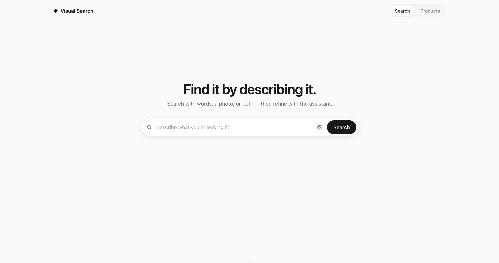
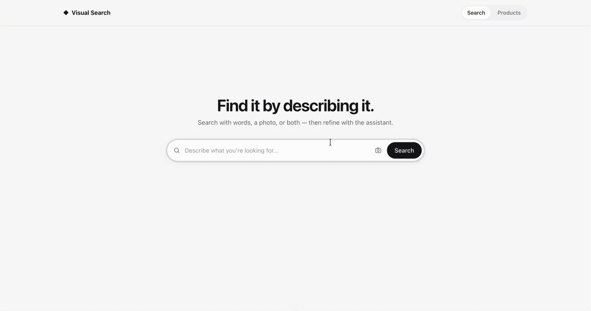
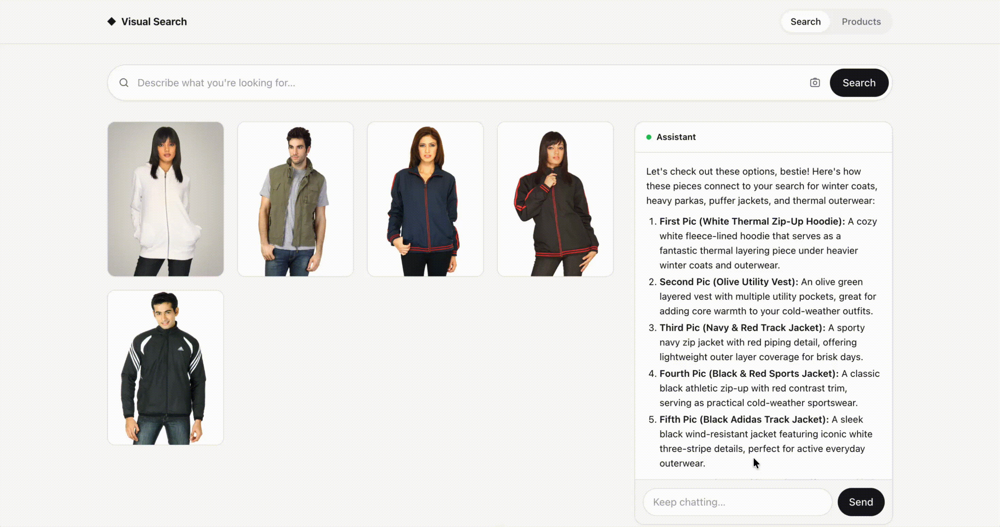
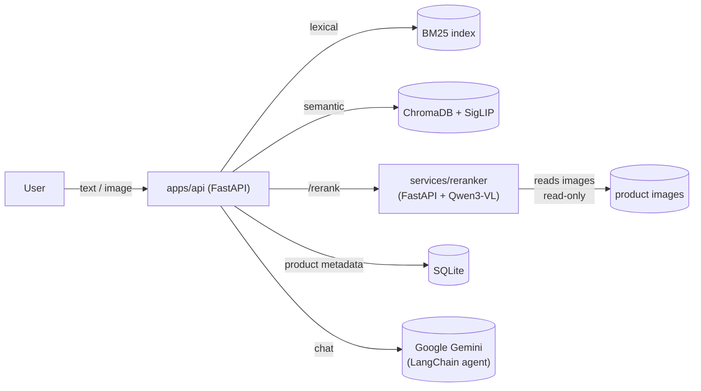

[](https://opensource.org/licenses/MIT) [](http://unmaintained.tech/)
# Visual Search



A multimodal fashion search prototype. Search a 3,065-product fashion catalog by text, image,
or both, then keep talking — a conversational agent sits on top of the same retrieval stack so
you can refine, compare, and ask follow-up questions about what came back.

## About The Project

Most "AI shopping search" demos are either a plain vector-search box or a chatbot bolted onto a
product feed with no real retrieval behind it. This project pairs both, properly:

- **Hybrid retrieval, not just embeddings.** Results come from BM25 lexical search *and*
  CLIP/SigLIP semantic search combined, so exact keyword matches ("red midi dress") and
  fuzzy visual/semantic queries ("something for a summer wedding") both work well.
- **Cross-encoder reranking.** A Qwen3-VL reranker rescoring the merged candidate set to sharpen
  ordering — most hybrid-search demos stop at the merge step.
- **Multimodal in, multimodal out.** Query by text, by image, or both at once — the agent can
  also pull in more product images mid-conversation instead of only returning text.
- **Graceful degradation.** If the reranker is slow, down, or disabled, the API falls back to
  un-reranked results instead of failing the request.
- **A real conversational layer.** A Gemini-backed LangChain/LangGraph agent sits on top of
  search, so the interaction isn't "one query, one result grid" — you can ask it to narrow
  down, compare items, or explain why something matched.

## Built With

**Backend / retrieval** (`apps/api`)

API:

[](https://fastapi.tiangolo.com/) 

Keyword Search:

[](https://github.com/xhluca/bm25s)


Vector Search:

[](https://www.trychroma.com/)
[](https://github.com/mlfoundations/open_clip)

Conversational Agent:

[](https://www.langchain.com/)
[](https://www.langchain.com/langgraph)
[](https://aistudio.google.com/)

Model Inference:

[](https://pytorch.org/) 
[](https://huggingface.co/docs/transformers)

Product Metadata:

[](https://sqlite.org/)

**Reranking service** (`services/reranker`)
- FastAPI + [Sentence-Transformers](https://www.sbert.net/) running a Qwen3-VL cross-encoder,
  served as a standalone, stateless scoring service

**Frontend** (`apps/web`)

[](https://vuejs.org/)
[](https://vitejs.dev/)
[](https://www.typescriptlang.org/)
- [Vue Router](https://router.vuejs.org/)
- [marked](https://github.com/markedjs/marked) + [DOMPurify](https://github.com/cure53/DOMPurify) — safe markdown rendering of chat responses

**Infrastructure**

[](https://www.docker.com)
[](https://docs.docker.com/compose/)

## Getting Started

### Prerequisites

- Docker and Docker Compose
- (Optional, for GPU reranking) NVIDIA GPU + [NVIDIA Container Toolkit](https://docs.nvidia.com/datacenter/cloud-native/container-toolkit/latest/install-guide.html)
- A LLM API key from a provider ([Google Gemini](https://ai.google.dev/) was used for the LLM chatbot). Change code according to chosen LLM provider.

### Dataset

The product catalog comes from this Kaggle dataset:
- [Embedding](https://www.kaggle.com/datasets/paramaggarwal/fashion-product-images-small)
- [Displaying](https://www.kaggle.com/datasets/paramaggarwal/fashion-product-images-dataset)

### Installation

1. Clone the repo:
   ```bash
   git clone <repo-url>
   cd ai-shopping-assistant
   ```
2. Copy the env template and fill in your LLM provider key (See [langchain](https://docs.langchain.com/oss/python/integrations/providers/all_providers)):
   ```bash
   cp .env.example .env
   ```
   `_API_KEY` complete based on chosen provider — everything else has a sensible default (see the comments in
   `.env.example`).
3. Build and run:

   CPU (no GPU required):
   ```bash
   docker compose up --build
   ```

   GPU (NVIDIA + Container Toolkit):
   ```bash
   docker compose -f docker-compose.yml -f docker-compose.gpu.yml up --build
   ```

The API is now at `http://localhost:8000` and the reranker at `http://localhost:8001`. CPU
reranking of the 2B-parameter model takes ~22–27s per query, so the CPU path raises
`RERANKER_TIMEOUT_SECONDS` to 30s; the GPU overlay tightens it back to 10s since GPU reranking
only takes ~1–2s.

## Usage

Open the web app and search by text, by image, or both — then keep chatting with the assistant
about the results.

### Search



### Chat



### API directly

```bash
curl http://localhost:8000/health
curl "http://localhost:8000/api/search?q=red+midi+dress"
```

See `apps/api/app/api` for the full endpoint set.

## Architecture



`apps/api` owns all product data (SQLite + Chroma + BM25) and the conversational agent;
`services/reranker` is a stateless scoring service with no database access.

## Tests

```bash
cd apps/api && uv run pytest
```

The suite is pure-logic and mock-based (no multi-GB model loads), so it runs in a few seconds.

## Notes & Limitations

- **Prototype scale.** The catalog is 3,065 products — retrieval quality and latency numbers
  above don't necessarily hold at production catalog sizes.
- **CPU reranking is slow by design tradeoff.** ~22–27s/query on CPU is only acceptable because
  this is a demo; a GPU (or a smaller reranker) is required for anything interactive at scale.
- **Reranking is best-effort.** The API intentionally serves un-reranked results rather than
  fail the request if the reranker is unavailable — don't assume every response was reranked.
- **Gemini dependency.** The chat agent is hard-wired to Google Gemini; there's no local/offline
  fallback for the conversational layer.
- **No auth, no persistence of conversations.** This is a search/chat prototype, not a
  production shopping app — there's no user accounts, cart, or checkout.
