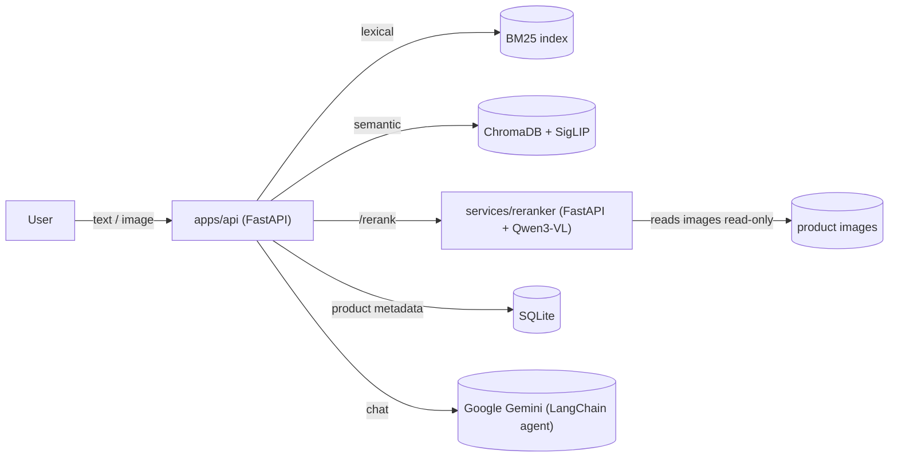

# AI Shopping Assistant

A multimodal fashion search prototype. Users search a 3,065-product fashion catalog by text,
image, or both; results come from hybrid retrieval (BM25 lexical + CLIP/SigLIP semantic search)
reranked by a Qwen3-VL cross-encoder, then handed to a Gemini-backed LangChain agent that can
chat about the results and pull in more images on request.

## Architecture



`apps/api` owns all product data (SQLite + Chroma + BM25) and the conversational agent;
`services/reranker` is a stateless scoring service with no database access. The API degrades
gracefully (returns un-reranked results) if the reranker is slow, down, or disabled.

## Setup

```bash
cp .env.example .env
```

Fill in `GOOGLE_API_KEY` in `.env` (required — the chat agent runs on Gemini). Everything else
has a sensible default; see the comments in `.env.example`.

## Running

CPU (no GPU required):

```bash
docker compose up --build
```

GPU (NVIDIA + Container Toolkit):

```bash
docker compose -f docker-compose.yml -f docker-compose.gpu.yml up --build
```

The API is at `http://localhost:8000` (`/health`, `/api/search`, `/api/chat`, ...) and the
reranker at `http://localhost:8001`. CPU reranking of the 2B-parameter model takes ~22-27s per
query, so the CPU path raises `RERANKER_TIMEOUT_SECONDS` to 30s (the GPU overlay tightens it
back to 10s, since GPU reranking only takes ~1-2s).

## Tests

```bash
cd apps/api && uv run pytest
```

The suite is pure-logic and mock-based (no multi-GB model loads), so it runs in a few seconds.
